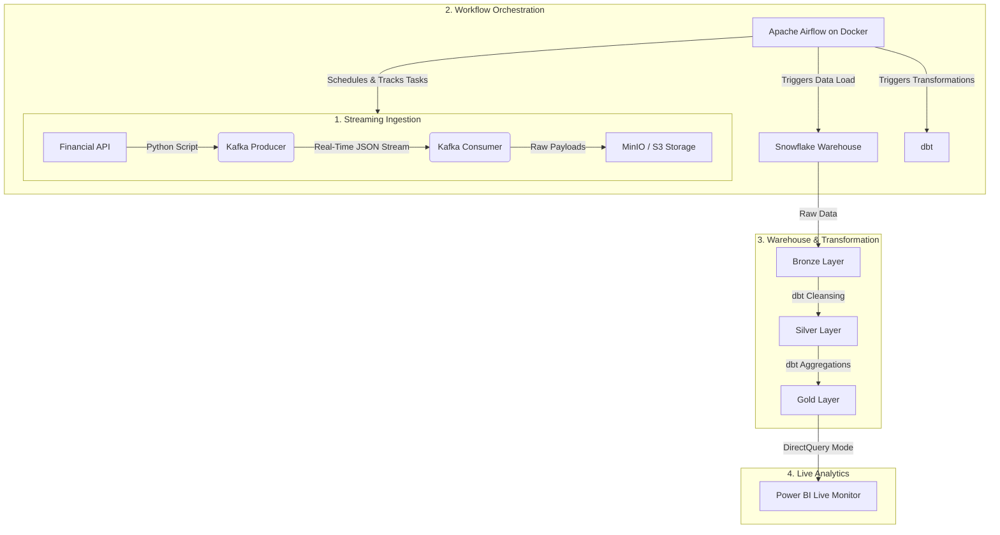

<h1 align="center"> Real-Time Stock Market Data Pipeline</h1>

<p align="center">
  
  
  
  
  
  
  
</p>

---

## 📌 Project Overview

The **Real-Time Stock Market Data Pipeline** project demonstrates a complete **modern streaming ELT pipeline** built to ingest, process, transform, and visualize live financial telemetry data for high-volume equities.

This project integrates **Python, Kafka, MinIO, Airflow, Snowflake, dbt, and Power BI** to automate the movement of streaming API data into a sub-minute analytics-ready dashboard.

The project focuses on:

✅ Automating real-time streaming data ingestion  
✅ Containerizing workflow orchestration with Docker  
✅ Building scalable Medallion Architecture transformations  
✅ Delivering sub-minute latency interactive dashboards  
✅ Generating dynamic market leaderboards and candlestick tracking  

---

## 🔄 Project Workflow

Live API Data → Apache Kafka → MinIO (S3 Storage) → Snowflake Bronze Layer → dbt Transformations (Silver/Gold) → Power BI Live Dashboard

---

## 🎯 Objectives

The major objectives of this project are:

✅ Build an end-to-end event-driven streaming ELT pipeline  
✅ Automate ingestion of continuous stock quotes using Apache Airflow on a 5-minute cron  
✅ Transform raw JSON variants into analytics-ready models using dbt  
✅ Implement a strict Medallion Architecture (Bronze, Silver, Gold)  
✅ Develop live-refreshing interactive dashboards using DirectQuery  

---

## 🗂️ Dataset Overview

The dataset contains live financial telemetry and stock market transaction records for mega-cap technology companies (AAPL, TSLA, MSFT, GOOGL, AMZN).

### Key Features Included:

- 📈 **Ticker Symbols & Assets**
- 💰 **Real-Time Trading Prices**
- 📊 **Open, High, Low, Close (OHLC)**
- 📅 **Live Minute-by-Minute Timestamps**
- ⚡ **Market Volatility Metrics**
- 🏆 **Daily Percentage Change & Sentiment**

These features help analyze intraday market behavior, sudden price action shifts, and overall tech sector performance trends.

---

## 🛠️ Tech Stack & Tools Used

| Category | Tools / Technologies |
|----------|----------------------|
| Programming | Python |
| Streaming Engine | Apache Kafka |
| Data Lake / Storage | MinIO (AWS S3 API Compatible) |
| Orchestration | Apache Airflow, Docker |
| Data Warehouse | Snowflake |
| Data Transformation | dbt (Data Build Tool), SQL |
| Visualization | Power BI (DirectQuery) |
| Version Control | Git & GitHub |

---

## 🧹 Data Ingestion & Processing

The project implements an automated, decoupled streaming workflow for handling high-velocity market data.

### ✔️ Data Ingestion Steps

- Fetched live financial payloads using **Python API Scripts**
- Streamed payloads in real-time via **Kafka Producers & Consumers**
- Landed raw JSON strings into local **MinIO Object Storage**
- Orchestrated bulk data loading into Snowflake via **Apache Airflow**

### 🔍 Processing Improvements

- Decoupled data extraction from loading using Kafka to prevent message dropping
- Containerized the orchestration environment for cross-platform reliability
- Structured scalable cloud-based ingestion architecture

---

## 🔄 Data Transformation with dbt

The raw JSON data was transformed into high-performance analytical aggregates using **dbt models** and a **Medallion Architecture**.

### Key Transformations Performed:

✅ Cleaned and parsed raw nested JSON strings in the Bronze layer  
✅ Built **Silver models** for data deduplication and schema enforcement  
✅ Created **Gold fact tables** for complex window functions and time-series rollups  
✅ Implemented **1-minute candlestick logic** directly in the warehouse  
✅ Optimized tables specifically for live BI DirectQuery rendering  

### Core Models Created:

- 📦 `bronze_raw_telemetry`
- 👥 `silver_cleansed_quotes`
- 🧾 `gold_minute_candlesticks`
- 📊 `gold_daily_kpi_leaderboard`

---

## 📊 Data Modeling & Analytics

A scalable analytics layer was created inside Snowflake to handle continuous, sub-minute querying.

### Analytics Features:

- ⭐ Medallion Schema implementation
- 📈 Optimized time-series reporting tables
- ⚡ Sub-minute query performance via flattened views
- 📊 BI-ready dynamic aggregations

---

## 📈 Dashboard & Visualization

Interactive dashboards were created using **Power BI** leveraging DirectQuery mode to generate actionable, real-time business insights.

### Dashboard Highlights:

- 📈 Live 1-Minute Candlestick chart stream
- 🌍 Dynamic, Auto-Sorting Market Leaderboard
- 🏆 Real-time Top Performer and Worst Performer highlighting
- 👥 Disconnected interaction states for isolated asset deep-dives
- 📦 Live KPI tracking (Open, Close, High, Low)
- 💰 Automated Page Refresh to eliminate manual updates

---

## 📊 Key Insights & Findings

✨ Engineered a zero-touch pipeline that requires no manual intervention to update  
✨ Achieved sub-minute data latency from API generation to dashboard rendering  
✨ Centralized complex business logic (volatility) into dbt rather than the BI tool  
✨ Improved visibility into micro-market trends for day-trading analysis  
✨ Enabled robust, fault-tolerant data ingestion through streaming brokers  

---

## 🚀 Business Impact

This project can support:

✔️ Real-time algorithmic trading analysis  
✔️ Financial market trend monitoring  
✔️ Latency-sensitive business reporting  
✔️ Data-driven portfolio management  
✔️ Scalable enterprise data engineering architectures  

---

## 🏗️ Pipeline Architecture

```text
Live API ➝ Apache Kafka ➝ MinIO Storage ➝ Apache Airflow ➝ Snowflake (Medallion) ➝ dbt ➝ Power BI
```



---

## ⚙️ How to Run This Project

### 🔹 Step 1 — Start the Orchestration Cluster
Spin up Apache Airflow and its dependencies using Docker.
```bash
docker-compose -f airflow/docker-compose.yaml up -d
```

### 🔹 Step 2 — Start the Streaming Engine
Run the producer and consumer scripts to begin fetching and staging API data.
```bash
python kafka/producer.py &
python kafka/consumer.py &
```

### 🔹 Step 3 — Setup Snowflake
Run the initial environment setup script inside your Snowflake worksheet.
```sql
snowflake/setup_queries.sql
```

### 🔹 Step 4 — Run dbt Transformations
Execute the data modeling pipeline to build the Bronze, Silver, and Gold layers.
```bash
cd dbt_project
dbt run
dbt test
```

### 🔹 Step 5 — Connect Power BI
- Open the `.pbix` file.
- Authenticate the DirectQuery connection to your Snowflake Gold tables.
- Enable Auto Page Refresh.

---

## 🔐 Security & Best Practices

✅ `.gitignore` implemented to protect API keys and Snowflake credentials  

✅ Containerized environments for isolated and reproducible builds  

✅ Version control using Git & GitHub  

✅ Modular transformation workflow utilizing dbt for version-controlled SQL  

✅ Decoupled architecture to prevent API rate-limiting and data loss  

---

## 📚 Learnings From This Project

🎯 Building decoupled streaming architectures with Apache Kafka  

🎯 Containerizing orchestration environments with Docker  

🎯 Automating task dependencies using Apache Airflow DAGs  

🎯 Designing robust data transformation layers via Medallion Architecture  

🎯 Configuring live-connection BI tools for streaming data use cases  

---

## 📬 Connect With Me

- **Sunny Kadam**

- 📧 Email: sunnykadam872@gmail.com

- 💼 LinkedIn: [www.linkedin.com/in/sunny-862](https://www.linkedin.com/in/sunny-862)
